> [!NOTE]
> The notes are written in English, but some screenshots show earlier versions of the model with Czech names.

1\.

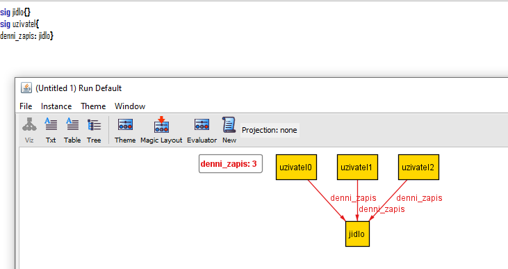{width="6.260416666666667in"
height="3.3125in"}I\'m trying to get more than one food per user, it\'s
not working

So it just works now idk

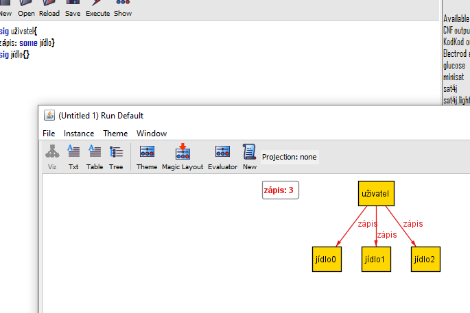{width="6.260416666666667in"
height="4.177083333333333in"}

Interesting - when I write it the other way around, the result changes

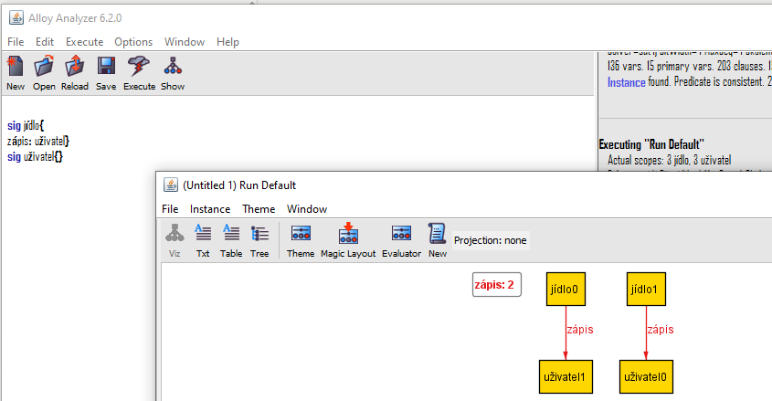{width="6.260416666666667in"
height="3.25in"}

Now I\'m trying to add calories as a mandatory part of every food

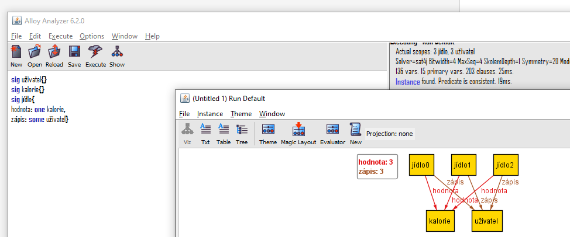{width="4.364832677165355in"
height="1.8229166666666667in"}

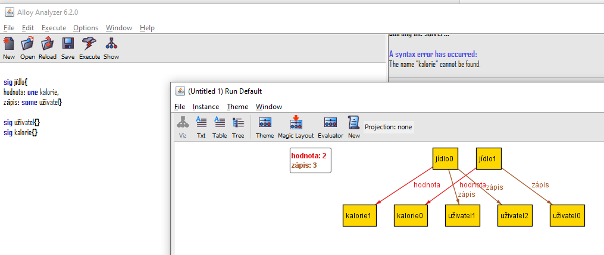{width="5.106535433070866in"
height="2.1666666666666665in"}

Interesting that the difference is based purely on the order the
signatures are declared in

Now there\'s a problem that not every food has its own calories

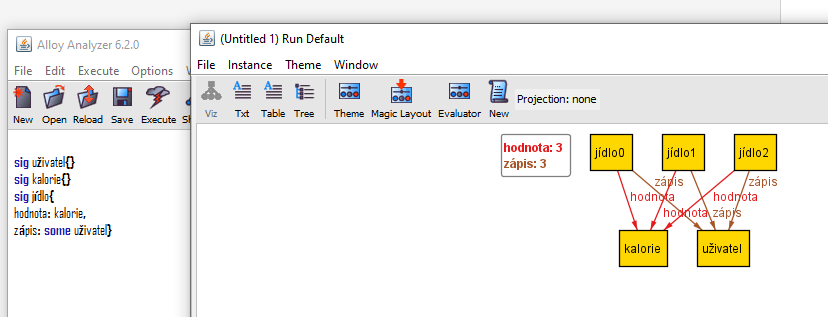{width="6.260416666666667in"
height="2.3958333333333335in"}

It\'s as if \'one\' had been written before \'calorie\' in the value
field

So let\'s fix it\...

sig user{}

sig calorie{}

sig food{

value: lone calorie,

entry: some user}

BUT that only says food has at most one, so it\'s better to put \'one\'
there because that\'s true going forward - every food has exactly one
calorie entry\
\
AHH great, success

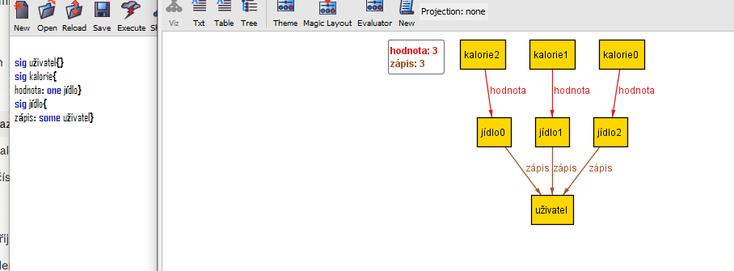{width="6.260416666666667in"
height="2.3125in"}I\'m a genius\... :DDDD

After clicking the "New" button, I was not pleasantly surprised:
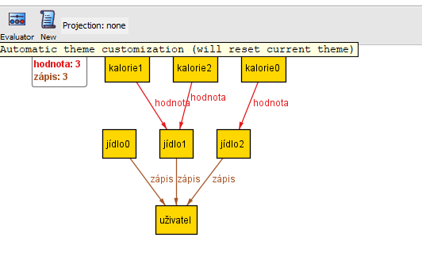{width="3.9043536745406824in"
height="2.4438910761154857in"}

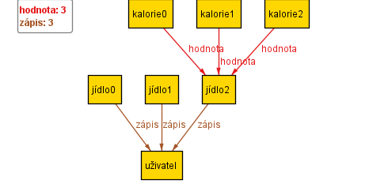{width="4.031812117235345in"
height="2.015906605424322in"}

So I need to declare that EVERY atom of the food signature has EXACTLY
ONE atom of the calorie signature

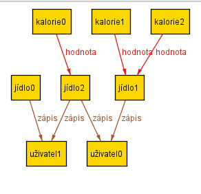{width="3.0420909886264216in"
height="2.9379101049868765in"}And this is also a problem: the atom
"food2" can only be attached to either "user1" or "user2"

So I still need to declare that: a food is attached to exactly one user

Ok\... it somehow fixed itself xd

Now I need to make calories a 1:1 relationship

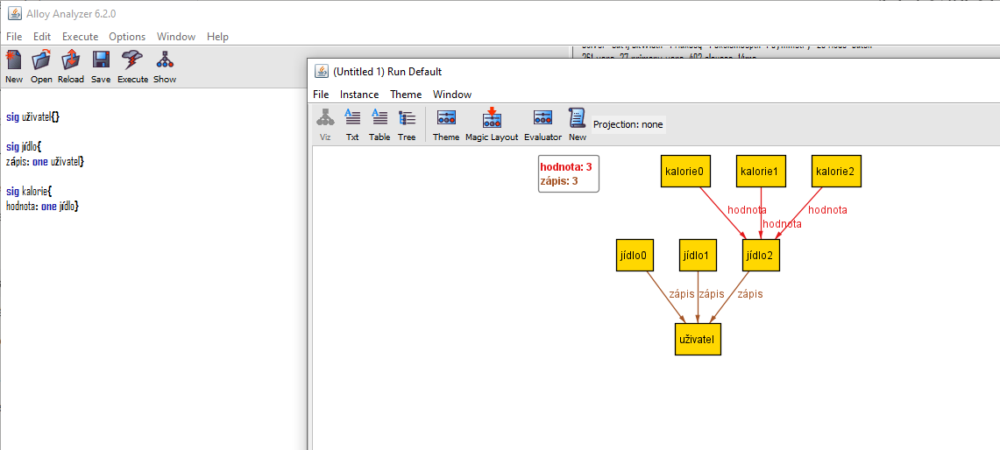{width="8.239583333333334in"
height="3.7153532370953632in"}One calorie HAS only one food, but ONE
FOOD can have several calories\...

Fix: I have to use FACT, because if I did it through another value
field, it would create a different instance of the field, and it\'s also
wrong because I\'d be referencing calories before the code even gets to
them

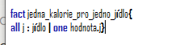{width="2.2086417322834646in"
height="0.5834142607174103in"}This fact solved it

[TODO: write down how this works]{.mark}

For all (all) j (instance of the food signature) from (:) food it holds
(\|) that the value (field) of that particular j is just one

Here, reverse lookup using "." is used

**value (for the case j = food2):**

**┌──────────┬─────────┐**

**│ calorie0 │ food2 │**

**│ calorie1 │ food2 │**

**│ calorie2 │ food0 │**

**└──────────┴─────────┘**

*"**value.j means:** \&quot;go through the table, find rows where the
right column is j, and return me the left columns from those
rows\&quot;"*

So: take a specific food instance (j) and look at what it\'s linked to
in the value table

One is used in the fact to check that the condition is met, that the
number of found shared elements for j in the value table (field) is only
one

So upon running, this fact - and by extension that one - has to be
satisfied

Criticism regarding calories: they should be numbers, not signatures.\
Fix:

Here I\'m playing around with colors:
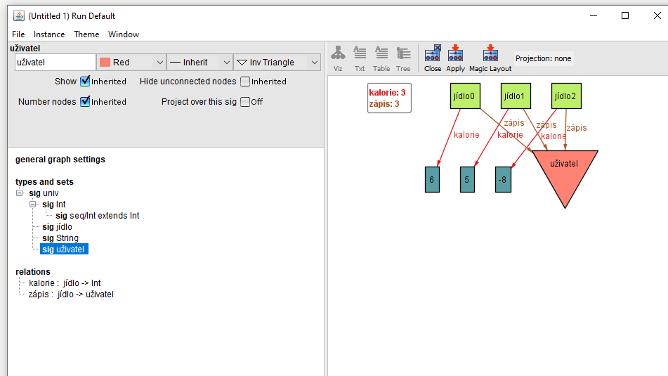{width="4.945358705161855in"
height="2.78125in"}

Well, the fix: same as with entry, where I put it into a field with
another signature, here I write the entry definition (calorie: ) but
after that I write int, and add \'one\' in front of it because the food
has one kcal value

But that results in two foods having one kcal value - which is ok, it
can be an identical value, BUT its OWN, so this has to be fixed using
fact + disj

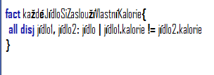{width="3.167108486439195in"
height="1.1147386264216972in"}(you can change the font in options)

What this actually does - first it\'s just naming\..., all disj:
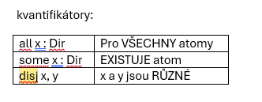{width="3.4588156167979003in"
height="1.3439370078740158in"}

Food1 and food2 are the x and y, which are food atoms because after that
comes **[: food]{.underline}** the pipe (**\|**) then applies to those
atoms: the calories belonging to food1 and to food2 must not (!=) match

What I\'m not sure about here is whether this then results in foods not
sharing identical atoms (which is the goal), or not sharing identical
calories (which would be very bad)

Int is actually a built-in signature in alloy, numbers are atoms of that
signature\... so it\'s actually the same thing, meaning that fact is
actually standing in my way :D

*I want every food to be able to have any value in kcal, but even when
the value is the same, I want every food to have its own atom with that
value, I don\'t want two foods referencing one calorie atom*

Yeah so I\'ll combine
it: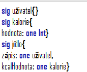{width="1.7814982502187227in"
height="1.4793733595800524in"}

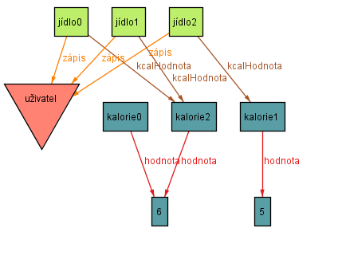{width="4.417283464566929in"
height="3.4900699912510937in"}

It\'s better, but I still have to sort it out with a fact

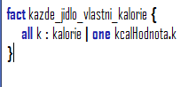{width="2.2086417322834646in"
height="1.0209755030621173in"}But this keeps happening

[I\'ll probably just leave it like this for now and ask whether what I
want is even achievable, and whether it even matters]{.mark}

[-solved]{.mark}

Negative numbers from Int

\> fact natural_numbers

{

all v : value \| v.calories \>= 0 and v.protein \>= 0

and v.carbohydrates \>= 0 and v.fats \>= 0

}

Now I have a problem with a standalone atom that should always belong to
someone but doesn\'t, specifically

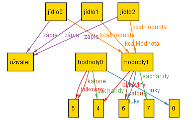{width="3.594251968503937in"
height="2.237047244094488in"}

This gets fixed like this:

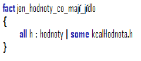{width="2.50034886264217in"
height="1.083484251968504in"}

I say that for every value atom it holds (**\|**) that it has at least
one food

Now I\'d like to do the following: **[protein + carbohydrates + fats =
calories]{.underline}**

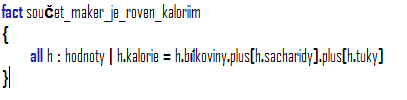{width="4.240174978127734in"
height="1.0418121172353456in"}

Addition works by writing .plus\[whatever I want to add\] after the atom

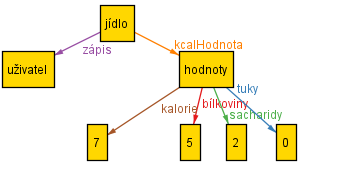{width="3.7296872265966754in"
height="1.8335892388451445in"}

Ok, next thing I\'ll do is functions

Functions:

Let\'s start by using fun, which is used to create sets

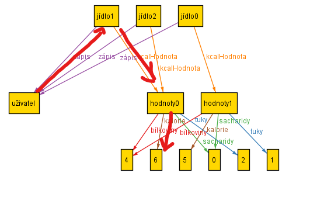{width="3.594251968503937in"
height="2.230686789151356in"}

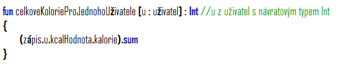{width="6.21961832895888in"
height="1.2085017497812773in"}So this is correct

[But I don\'t get why, I don\'t really understand the
referencing]{.mark}

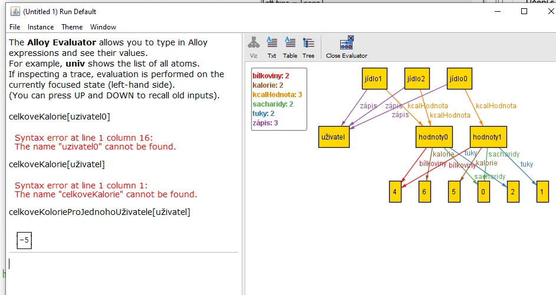{width="6.260416666666667in"
height="3.3229166666666665in"}Now I have a problem with the scope of
Int: [it\'s too small, but if I increase it via run, it just shows
overall higher numbers and nothing much changes]{.mark}

AHA

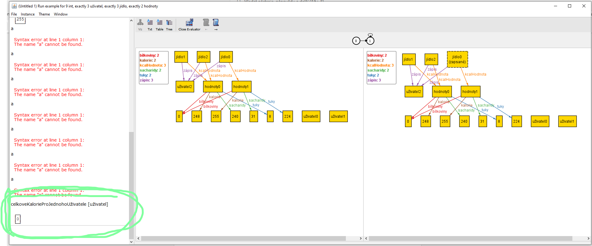{width="6.260416666666667in"
height="2.6145833333333335in"}

Now I\'ve also added removing food, and since there\'s a variable for
that function in the pred, when I reference it later in a fact I can
name that variable something else entirely (the world still makes
sense)\
interesting that I now understand better that using pred I basically
create a function, and using a fact with always in it I say that one of
the x functions defined in pred always happens, which is in its own way
mega satisfying

Now a test:

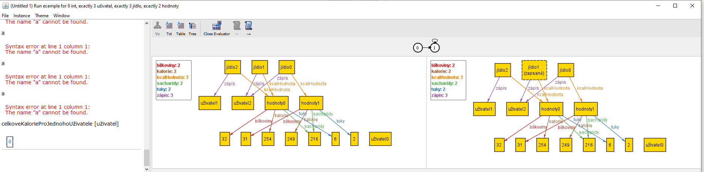{width="6.260416666666667in"
height="1.5416666666666667in"}here you should be able to see how none of
the foods were logged (1), then subsequently one of them was (2), and
then it was removed from the logged ones (3)

Fun, which is the command I use, counts only the logged ones like this:

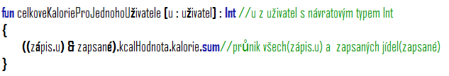{width="6.260416666666667in"
height="1.0729166666666667in"}& is used for intersection

**[Next thing: rewrite the names in the code so they make more
sense]{.mark}**

**[[TODO:]{.underline}]{.mark}**

1)  Ok so I started the English version as a new branch, I still need to
    translate the comments in it

2)  change names for better clarity

3)  I\'ll stick to just one of the versions (cs/**en**)

4)  Think about how to make it so foods in the database aren\'t attached
    to a user, but are still attached to values, and only get attached
    to a user once they\'re logged

5)  Solve the problem with fact_total\...

6)  Add saturated and unsaturated fatty acids under fats

    - For that, I need to find out what the relationship between them is

1\) done, no problem

2\) not yet

3\) it\'ll be in English, and if there\'s extra time I\'ll translate it
to Czech

4\) I removed the log field and kept just logged, and logged is now
under user as
var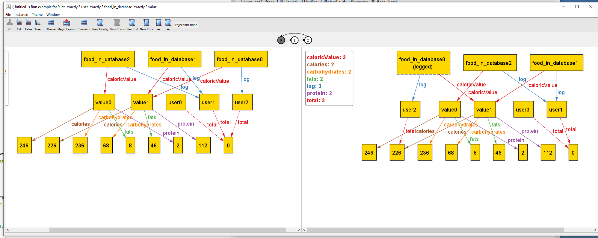{width="5.708333333333333in"
height="2.2795341207349082in"}

It sort of works, but there are problems, see next page

5\) I added to the fact that the calculation falls under always, and
that the total field is var

6\) this probably won\'t be necessary

Problems with
4):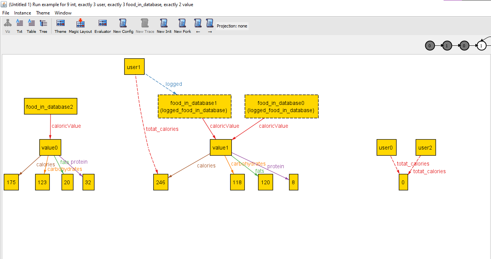{width="6.260416666666667in"
height="3.3125in"}

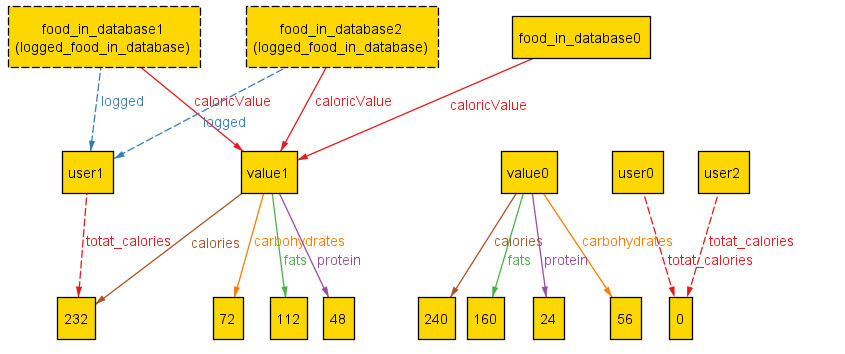{width="6.260416666666667in"
height="2.625in"}Yeah, here I somehow messed up the code versions so the
second image just wasn\'t current, I had to write some things back in
because even on github it was the old version

- food is in logged EVEN IF it has no owner \<- wrong

- Total_calories doesn\'t work for multiple foods

- Value exists without foods

- Food exists without values

Uu this is neat logged\' = logged + (u -\> f)

-\> marks that whole row of the entry, so I don\'t have to write out x
lines for every item I want to delete

------------------------------------------------------------------------

this is just starting to look nice now and I\'m happy about it!!

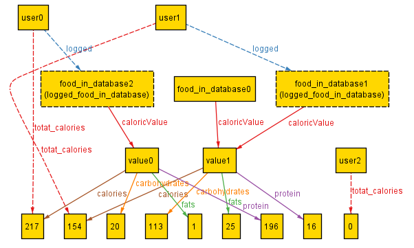{width="4.229166666666667in"
height="2.533277559055118in"}

------------------------------------------------------------------------

I actually never really got around to using check, now I used it to find
a faulty instance, and it exists, that\'s bad :(

Uh-oh, there\'s a problem here, monke am
I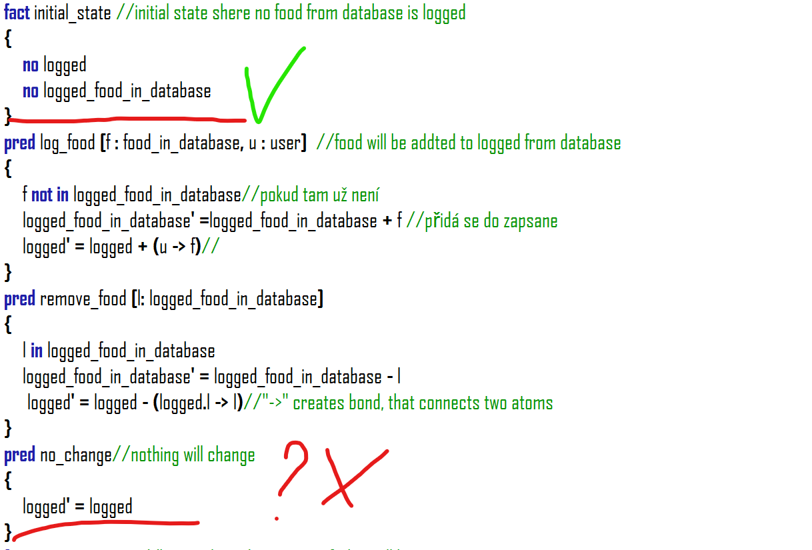{width="6.260416666666667in"
height="4.239583333333333in"}

Now I\'m playing around with run and
check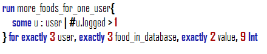{width="4.583973097112861in"
height="0.9376312335958005in"}

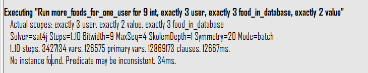{width="6.260416666666667in"
height="1.2395833333333333in"}

This instance isn\'t possible according to the definition :/

But there\'s probably a problem in the notation here, like before, in
that it\'s not var and isn\'t ready for behavioral modeling\...let\'s
try this:

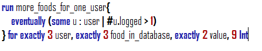{width="4.656899606299213in"
height="0.9167946194225722in"}

and\...:

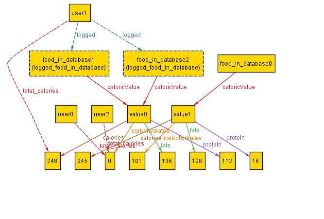{width="3.5833333333333335in"
height="2.414725503062117in"}

Oh oh oh oh ohh

Now I\'ll check if the math adds up:

Ok, it doesn\'t add up

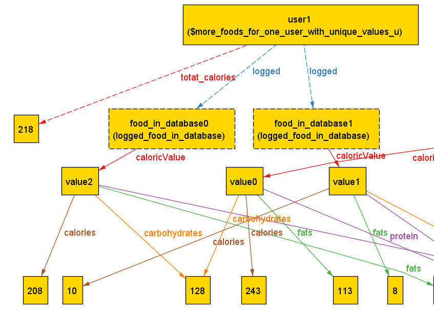{width="6.260416666666667in"
height="4.46875in"}Yesss so if the value is unique it works, only when
the value is the same it can\'t add it up

Ok ok looks
good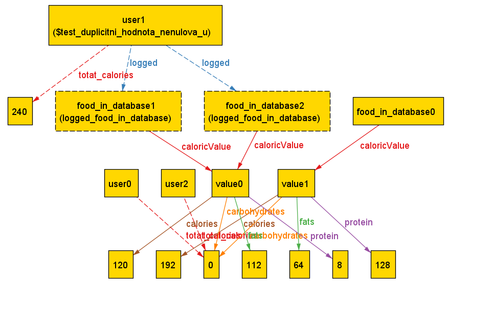{width="4.635416666666667in"
height="3.046571522309711in"}
