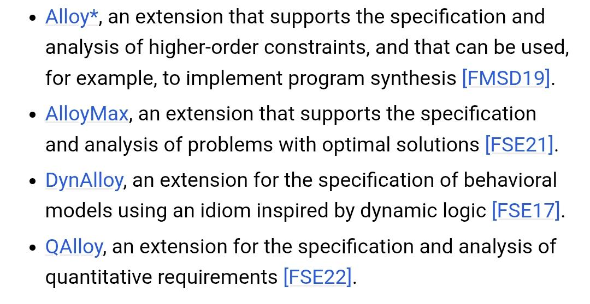
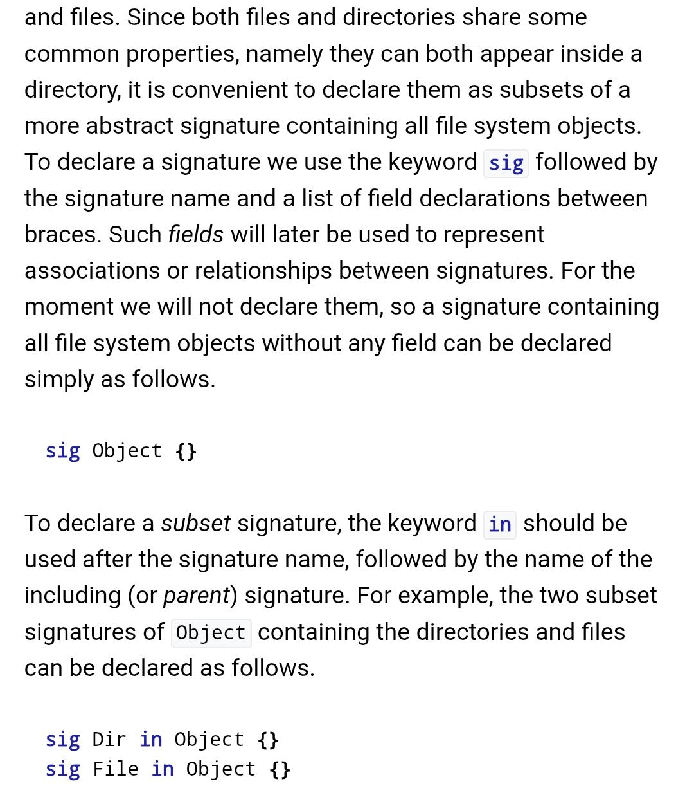
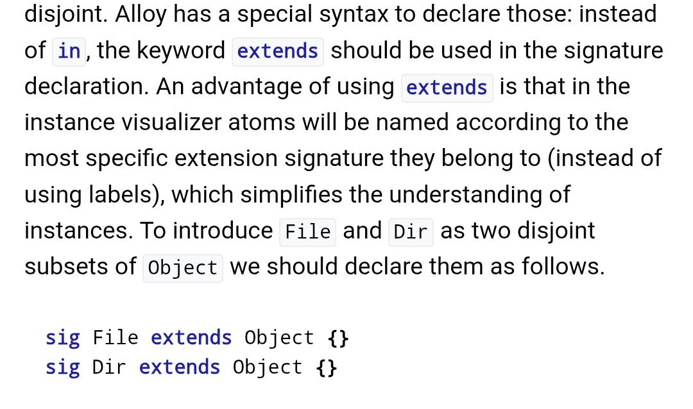
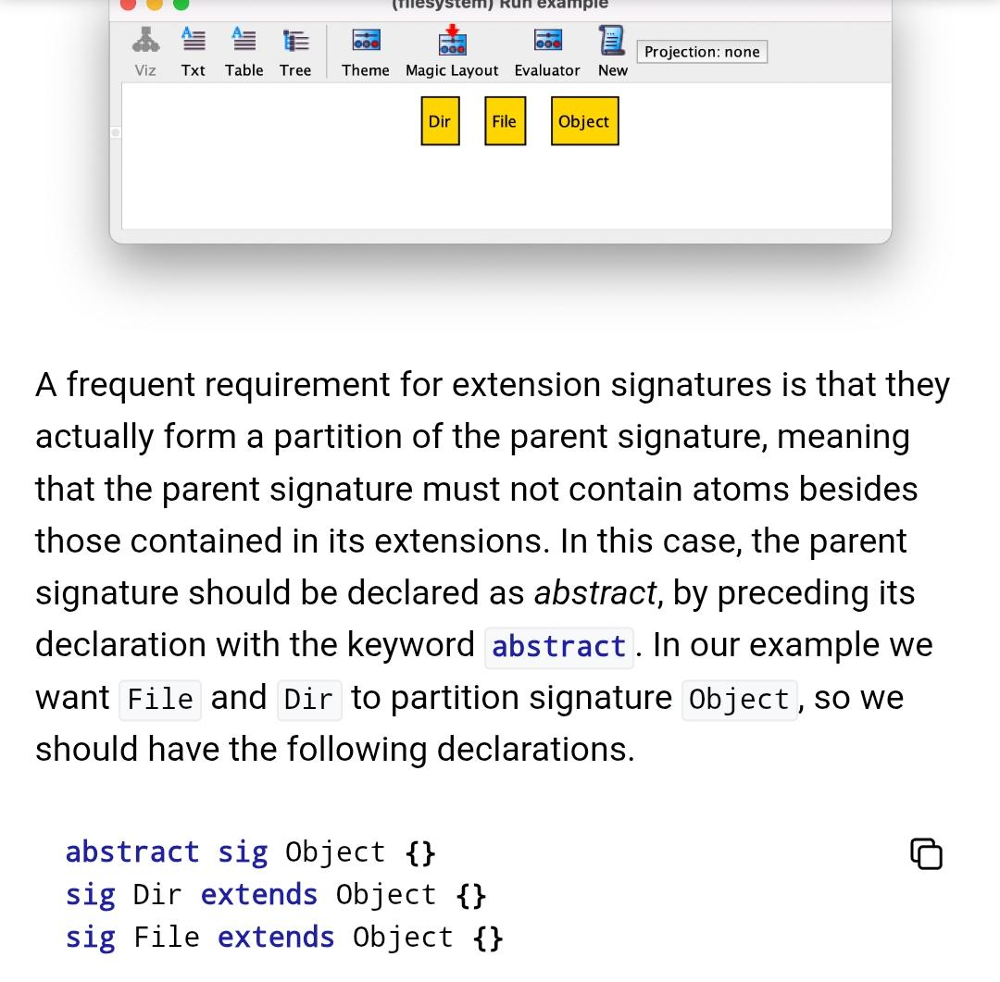
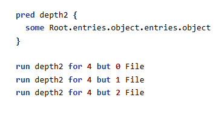
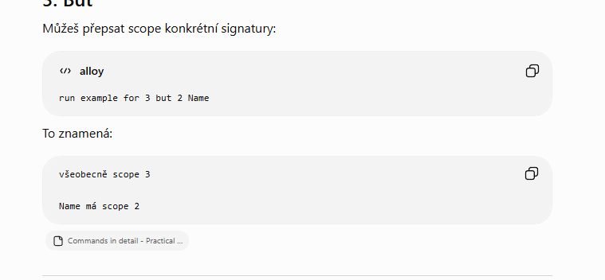
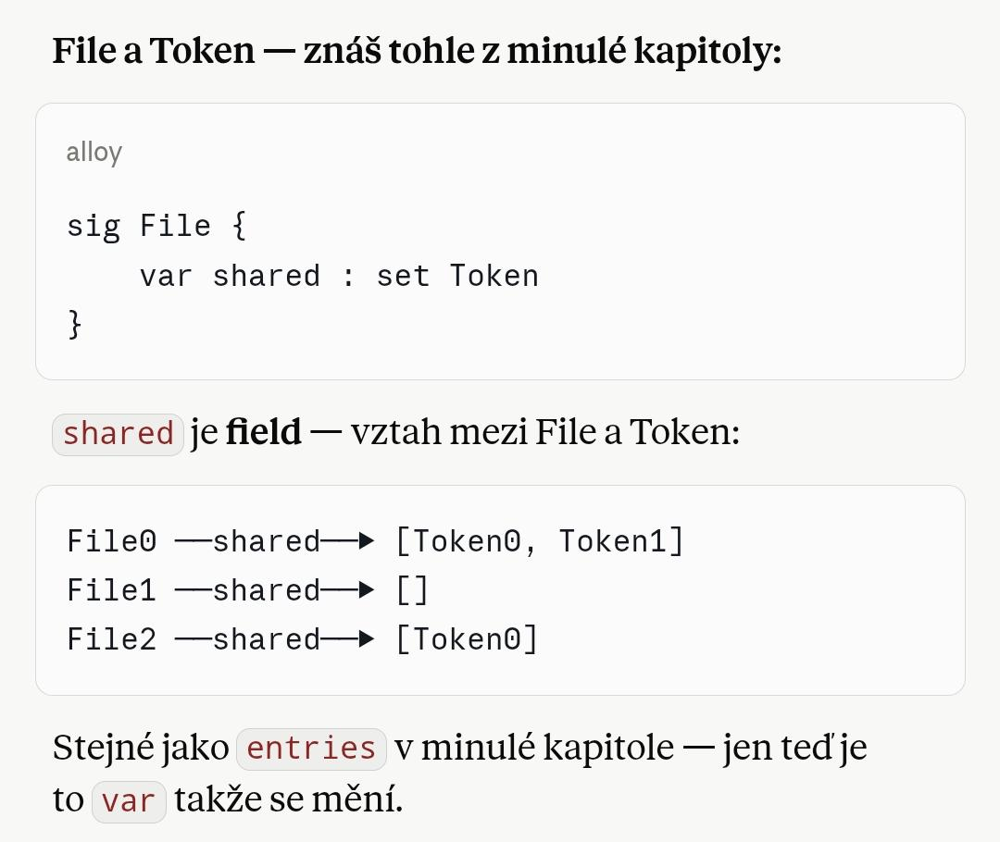
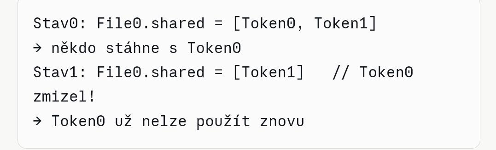
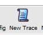

Alloy analyzer is something I kind of give commands to, and it checks
the logic of the software

Structural/behavioural modeling

Modeling is, I guess, an abstract description of some piece of
software - conceptually what functions, classes etc. are in it and how
they\'re supposed to work together

And in Alloy you can do this, and quickly and cheaply test what works
and what doesn\'t

MIT, the 90s

{width="3.647123797025372in"
height="1.8841721347331584in"}

It has extensions

**[Basic definitions of the core concepts/terms:]{.underline}**

Subset signatures - one atom belongs to several signatures at once
(barely ever used)\
Abstract signature - you can extend from it, but it can\'t be used on
its own\
Atom - the smallest unit in Alloy, the "object" that comes from a sig
(sig Dir{} -\> **Dir0 \<- atom**)\
Signature - a set of atoms\
entries - the name of the relation (doesn\'t matter what it\'s called)\
entries : set Entry sets up the connection from the sig we\'re writing
this in, to Entry\
Field - a relation between signatures\
TL Signature - not an extension of anything\
extension signature - a subset of another signature

Scope - determines the max number of atoms that will be generated

+-------------------------------+
| > **Entry, Dir and File are   |
| > signature names**           |
| >                             |
| > **Entries is a field**      |
+-------------------------------+

Relational operators

  ------------------------------------------------------------------------
  .     Navigation
  ----- ------------------------------------------------------------------
  \^    All descendants

  \~    d.entries (normal, entry \[entries is a field with Entry\] in
        dir); entries.e which Dir e is in\
        =\>\> Sig.field, atom.Field is normal navigation **BACKWARDS**
        it\'s then Field.atom\
        {the \~ is barely ever used, more just . with reversed logic}

  -\>   x -\> e in entries, the pair (x, e)
  ------------------------------------------------------------------------

**sig \> atom \> field**

Boolean operators:

not / !

and / &&

or / \|\|

implies / =\>

iff \<=\>

quantifiers:

  ---------------------------------
  all x : Dir  For ALL atoms
  ------------ --------------------
  some x : Dir THERE EXISTS an atom

  disj x, y    x and y are DISTINCT
  ---------------------------------

Cardinality:

How many atoms are inside the set

Directory.thingy(field)

  ---------------------------------------------------
  no       Does the directory have ZERO atoms in
           thingy?
  -------- ------------------------------------------
  some     Does the directory have AT LEAST ONE atom
           in thingy?

  one      Does the directory have EXACTLY ONE atom
           in thingy?

  lone     Does the directory have AT MOST ONE atom
           in thingy?
  ---------------------------------------------------

Multiplicity in declarations

For setting a rule using no, some, one, lone

lone entries.e - does e belong to entries in at most one directory?

Commands:

run - is this even possible, can this be done

check - statement -\> try to disprove it

these commands are kept in some kind of history in the file

you start with an empty run to check that everything works

then you move on

fact

I use fact to define a condition that must always hold, the analyzer
follows it

for example: Object in Dir + File, meaning atoms from Object must be
EITHER in Dir OR File

assert

this is used to create a condition, which then gets put into check

+--------------------------------------+
| // assert = a named claim            |
|                                      |
| assert no_partitions {               |
|                                      |
| all o : Object \| reachable\[o\]     |
|                                      |
| }                                    |
|                                      |
| // check then verifies that assert   |
|                                      |
| check no_partitions                  |
+--------------------------------------+

-but it also works without it - you can write the condition straight
into check instead of putting it in assert)

Set operators

+------+-----------------------+
| > &  | > intersection (what  |
|      | > they have in        |
|      | > common)             |
+------+-----------------------+
| > \- | > Difference,         |
|      | > subtract the set    |
+------+-----------------------+

fun - returns a set

fun name \[parameter : Sig\] : return type { expression }

-I create the parameter here (name it, say, „o")

Something gets applied to it, e.g. .\^(entries.object) //all descendants

SO THIS GIVES ME SOME SET

and then we use pred for a true/false result

pred - returns true/false / it\'s possible / it\'s not possible

this calls a condition on atoms/a set of atoms

pred name \[parameter : Sig\] {expression}

here the expression checks that o is in root or in the set
descendants\[Root\], and it gets named, say, reachable

-so basically either root or inside root

Structural modeling

Signature declaration

{width="3.3246128608923886in"
height="3.8050306211723535in"}

The whole code file is called a Domain (I think)

A distinguishing feature of Alloy is that commands can be included
together with the declarations and constraints in a model.

**(I don\'t get it)**

-I understand it as: in one file I have both the sig and then also some
definitions, like for example that a file always has a unique name, and
normally that would be in separate files

The parts of the code are called atoms, basically those pieces of code
only depend on each other through the relations they have between them
(relations)

isomorphic atoms - when it\'s given that person1 is a friend of person2,
then the reverse is technically a different declaration but the same
one, and the analyzer treats it as one

if you hit \'new\', it won\'t just state the same thing with the tag
swapped, it\'ll say that person2 is friend of person0, in a cycle (no
idea why that\'s relevant)

meaning the names don\'t just get randomly reassigned, both versions get
printed out

{width="5.039583333333334in"
height="2.9763888888888888in"}

extension of a top level signature

{width="4.28125in"
height="4.205555555555556in"}

you can\'t make constants, just simply name something, but we can limit
how many\
individual instances there are\
\
I can have one thing named with multiple names (that\'s called a hard
link)\
\
when I have one sig Root extends Dir {}, Root already has scope 1

one sig Root extends Dir {}

it just makes a single root, no root0,1,2,\...

Field declaration

Signatures just define that something exists

Fields define relations between atoms

Sig Dir extends Object {

Entries : set Entry

}

-Inside Dir there\'s Entry

So Dir owns Entries

Field multiplicity determines how many relations an object has, e.g. how
many Entries a dir has

**Subset signatures(⊆ - subset)**

Just like you have relations between numbers x and y (\<;\>;=;\...),
this is a relation too, just for a single element (the evenness of a
number, for example)

In the table, this is recursion (a discussion forum: posts \> a post
replies to a post)

Extended \[signatures\] can\'t share an atom, disjoint - ensures that
for a signature there\'s an atom that doesn\'t belong to more signatures

subsets can share an atom, for example Dir is a subset of Object

Basically when I want to mark something but not necessarily everything,
and you can also make a Field out of it

Multiple inheritance

Alloy can\'t do that

So to get around this, you make signatures "a,b,c" in whatever you\'re
inheriting from

+---------------+
| sig Shape in  |
| Tag {}        |
|               |
| sig Label in  |
| Tag {}        |
|               |
| sig Alert in  |
| Tag {}        |
+===============+

With this I get the following: Then I say: Alert = Shape & Label

> \[Alert ⊆ Shape ∩ Label\]

{width="2.5642902449693787in"
height="2.3961679790026245in"}

**Enumeration signatures**

**Enumeration signature**

A set of predefined values (the set 1; 8; 63)

I make such a set like this:

Enum Name { thing1, thing2, thing3}

Which creates the set Name = {thing1; thing2, thing3}

If I do, say

In the sig definition I can then define -\> name : one Name, so all the
atoms in it must have thing1/2/3

So I do: Atom0.name = thing2,\...

**"Commands+"**

You can do this

{width="3.8234503499562553in"
height="1.9586067366579178in"}

{width="6.260416666666667in"
height="2.90625in"}

-If I already have one sig, I can\'t change the scope like this

-if I define object 3 and file3, dir3, that logically doesn\'t work
because dir is an instance of object, so there\'d have to be 6 objects

-if I have File some somewhere, but I use up the whole scope on Dir, it
complains

**\-\--** **\-\-\-- add the remaining advanced topics \-\-\--**
**\-\--**

**Behavioral modeling**

Structural modeling was about static things, here time gets added to it.

Transition System

**States** of objects

They\'re determined implicitly, for example I just make a rule (fact)
that says something has 0 atoms, and that\'s then effectively the first
state

Concepts: var - an object marked like this can change with **states**

For example:

+----------------------------------------------------------------------+
| sig Token {}                                                         |
|                                                                      |
| sig File                                                             |
|                                                                      |
| {                                                                    |
|                                                                      |
| var shared : set Token // changes                                    |
|                                                                      |
| }                                                                    |
|                                                                      |
| var sig uploaded in File {}                                          |
|                                                                      |
| var sig trashed in uploaded {}                                       |
+======================================================================+

I have a set of tokens, a file refers to an arbitrary number of tokens,
which is fixed though**,** so every File atom has a set of tokens of an
unspecified size, thanks to "var" the number of Token atoms assigned to
a File can change depending on the state

And inside File there\'s uploaded, and inside uploaded there\'s trashed
(mutable - changeable)

so trashed is also a file, but it\'s a subdomain within the uploaded
domain, which contains all the uploaded Files

Initial state:

Fact init { no uploaded

no shared}

{width="4.113643919510062in"
height="3.466035651793526in"}This rule makes it so init has no atoms in
it

Purpose of tokens:

{width="3.984722222222222in"
height="1.2131944444444445in"}

+----------------------------------------------+
| fact transitions {                           |
|                                              |
| always (                                     |
|                                              |
| (some f : File \| upload\[f\] or delete\[f\] |
| or restore\[f\]) or                          |
|                                              |
| (some f : File, t : Token \| share\[f, t\])  |
| or                                           |
|                                              |
| (some t : Token \| download\[t\]) or         |
|                                              |
| empty                                        |
|                                              |
| )                                            |
|                                              |
| }                                            |
+==============================================+

Always says that something must hold in every state

Eventually says that it\'s possible

These two things are "operators of linear time temporal logic" and they
determine what\'s supposed to happen in each state

Some - some atom gets picked

\| - carry out \[an action\] on the atom

Or - or perform \[an action\] on the atom

Some „f" atom from File, which(\|) is in uploaded/restored/delete

Specifying actions

Here I\'m actually using pred

+----------------------------------------------------+
| pred upload \[f : File\] {                         |
|                                                    |
| f not in uploaded // GUARD = „f is not yet in      |
| uploaded"                                          |
|                                                    |
| uploaded\' = uploaded + f // EFFECT = „add f to    |
| uploaded"                                          |
|                                                    |
| }                                                  |
+====================================================+

This says that atom f, a file which isn\'t in the uploaded subset, will
get added to the uploaded subset

Stutter

-if nothing happened, the system waits

+---------------------+
| pred stutter {      |
|                     |
| uploaded\' =        |
| uploaded            |
|                     |
| trashed\' = trashed |
|                     |
| shared\' = shared   |
|                     |
| }                   |
+=====================+

It gets added after empty as: " or stutter"

Validating the design

Before this, we just ran an empty run as a check, which told us whether
all the facts were satisfied. NOW I can, for instance, click
{width="0.4498392388451444in"
height="0.32332239720034994in"} new config, and that gives me a larger
number of atoms

New trace
{width="0.7709405074365704in"
height="0.635505249343832in"} again, with the same atoms, creates a
different sequence of actions**(I don\'t get it)**

New init changes the initial state, which probably doesn\'t work here
(in this design of the data-sharing app)

New Fork - for a given state, a different state gets chosen than would
otherwise be there

Verifying the expected properties
